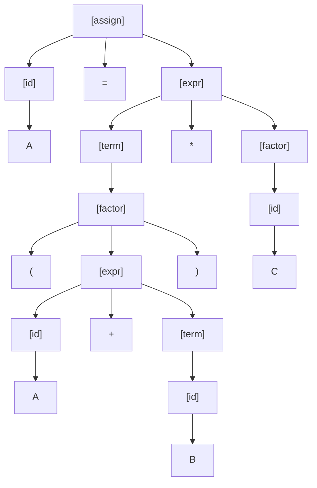
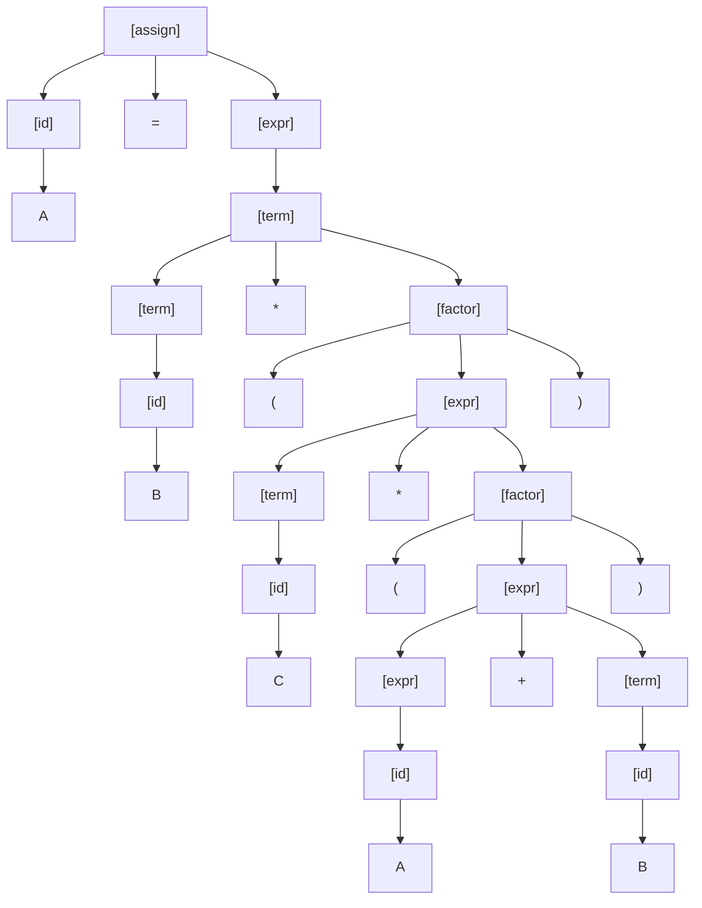

# John Akujobi - Assignment 2 - Addressing
CSC 461 Programming Languages  
**FALL 2024**  
**Dr. Stephen Krebsbach**  
**Ass #2 – 35 points Due: Monday Sept. 30th, 11:59 PM**  
Drop in Dropbox when completed.

---
## Pseudocode:
### P1.A  Explain Absolute Addressing and why it can cause issues when programming our Pseudocode.
**Absolute Addressing:** This is when we specify an exact memory location to jump to in our code. For example "jump to memory address 250"
**Issues**:
- **Inflexible**: By relying on specific memory addresses, the code becomes very rigid. Here, it is hard to add new code, move, or remove code, because we have to update all references manually when memory locations change.
- **Complex to read and maintain**: Its difficult to know what each address represents. It is very cumbersome to track specific memory addresses if we need to debug or modify the program.
- **Error-prone**:  It is very easy to create errors and bugs when manually managing the addresses. For example, accidentally reusing an address.

### P1.B LABEL statements were implemented to break from the Absolute addressing approach. Explain what additional logical data structure was created to implement the logic of LABEL statements.
**LABEL Statements**: These allow us to use symbolic names to represent points in our program instead of hardcoding memory addresses.
They make the code more readable, maintainable, and easier to work with.

To implement the logic of LABEL statements, we created **Symbol tables**. This logical data structure stores mappings between the labels and their corresponding memory addresses. During execution, this helps the system know where to jump to.


---
## Chapter 1:
### P2. What is the disadvantage of having too many features in a Language?
Having too many features in a language can easily make it difficult to learn and use the language.
- **Lower Readability:** More features usually make the language complex. This can make the code harder to read, understand, and maintain.
- **Maintenance difficulty**: If a language has too many features, developers can use so many different features to solve the same problem. This will reduce the consistency of code and make it challenging to maintain programs and systems.

[Personal Take]
Personally, i believe that languages should be able to have more features to keep up with changing technology and systems. But they should do these by adding packages, extensions, external component and modules that boost the functionality of the basic language.
In this setup, there is a basic language with basic features that can be augmented with those components to make it more powerful. This would allow them to increase features to meet needs, while being backward compatible. A good example of this setup is the python programming language having packages (tkinter, flask) and extensions (cpython, micropython) that allow it to punch far beyond its weight as a scripting language and expands its use into new domains

### P3. What is aliasing?
Aliasing happens when 2 or more distinct variable names are used to access the same address, or memory location.

### P4. What is the name of the category of programming languages whose structure is dictated by the von Neumann computer architecture?
This category of languages is called imperative languages.

---
## Chapter 3:
### P5. 
Using the following grammar, show:
1) A parse tree 
2) A leftmost derivation, for each of the following statements (S1 and S2)

**Grammar:**
```
<assign> → <id> = <expr>
<id> → A | B | C
<expr> → <expr> + <term>
        | <term>
<term> → <term> * <factor>
        | <factor>
<factor> → (<expr>) 
        | <id>
```

**Statements:**
- **S1)** A = (A + B) * C
- **S2)** A = B * (C * (A + B))
### P5.A **S1)** A = (A + B) * C


```mathematica
<assign>
<id> = <expr>
A = <expr>
A = <term> * <factor>
A = (<expr>) * <factor>
A = ( <expr> + <term> ) * <factor>
A = ( A + <term> ) * <factor>
A = ( A + B ) * <factor>
A = ( A + B ) * C
```




---
### P5.B  **S2)** A = B * (C * (A + B))
```mathematica
<assign>
<id> = <expr>
A = <expr>
A = <term>
A = <term> * <factor>
A = B * <factor>
A = B * (<expr>)
A = B * (<term>)
A = B * (<term> * <factor>)
A = B * (C * <factor>)
A = B * (C * (<expr>))
A = B * (C * (<expr> + <term>))
A = B * (C * (A + <term>))
A = B * (C * (A + B))
```



---
### P6.
Consider the following grammar:
```
<S> → <X> a <Y> b
<X> → <X> b | b
<Y> → a <Y> | a
```

Which of the following sentences `<S>` are in the language generated by this grammar?
- Circle answers on this line → a b c d
**Options:**
- a) **<strong><u>baab</u></strong>**
- b) bbbab
- c) bbaaaaa
- d) <strong><u>bbaab</u></strong>

---
### P7. Consider the following grammar:

```
<S> → a <S> c <Y> | <X> | b
<X> → c <Y> | c
<Y> → d | <X>
```

Which of the following sentences `<S>` are in the language generated by this grammar?
- Circle answers on this line → a b c d

**Options:**
- a) abcd
- b) acccbd
- c) accbcc
- d) <strong><u>acd</u></strong>
- e) <strong><u>accc</u></strong>

---
### P8.A Explain what an ambiguous grammar is.
This is a grammar that has more than one parse tree (derivation) for a single string in the language
### P8.B Explain why even if a grammar is NOT ambiguous it could still be defined to not work the way the designer may wish in terms of operator precedence…
Many times, a grammar needs additional rules, or structure to make sure expressions are interpreted the way the designer intended.
Here is an example related to operator precedence:
- If a language has both addition (+) and multiplication ( * ). Which one should have the higher precedence, or should they have the same?
	- Usually, multiplication has higher precedence. This means `a + b * c` should be interpreted as `a + (b*c)`
- If the grammar doesn't encode the precedence properly, we could end up making a parse tree where addition is done before multiplication. This will lead to incorrect results.
#CSC_461_Programming_Languages